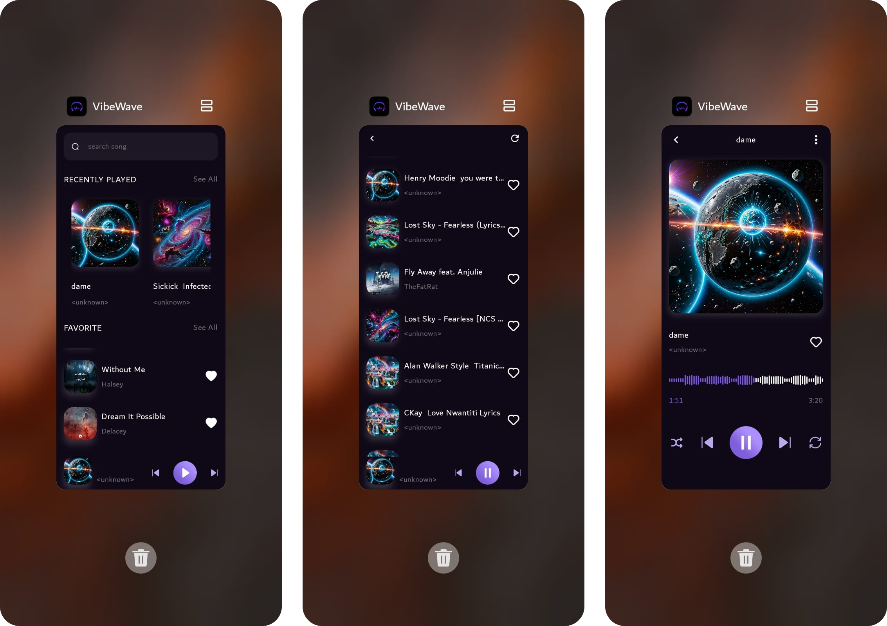

# Vibewave

**Vibewave** is an Android music player app that lets users play music stored on their devices. The app is built with modern Android development tools and best practices.

## Features

- Play music files from your device
- Intuitive and responsive UI
- Smooth playback controls

## Screenshots

## Download

[Download APK](blob:https://github.com/4d254c8b-5e7f-4ff0-9adf-692be0382334)

## Tech Stack

- **Kotlin**: Main programming language
- **Jetpack Compose**: Modern UI toolkit for building native interfaces
- **Layered Architecture**: Clean separation of concerns
- **MVVM (Model-View-ViewModel)**: For robust state management
- **Hilt**: Dependency injection framework

## Getting Started

1. Clone the repository
2. Open in Android Studio
3. Build and run on your device

## License

This project is licensed under the MIT License.
